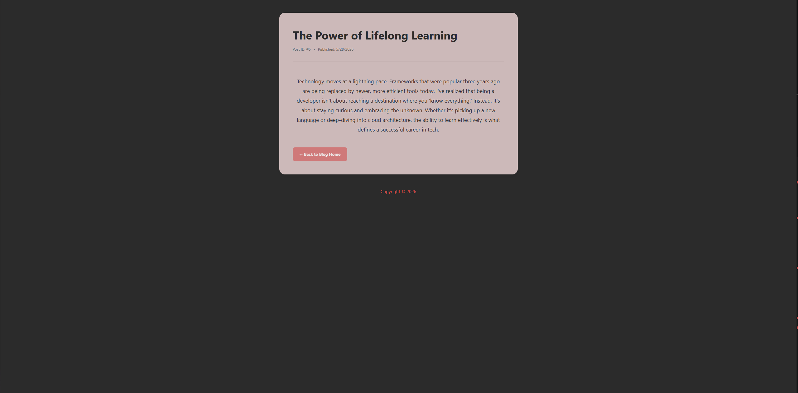

# Dev Blog

A responsive web application demonstrating the implementation of Node.js and Express for server-side logic and EJS for dynamic templating.

---

## Screenshots

### 📱 Responsive Homepage

  
Click to view screenshots (Desktop, Tablet, Mobile)

- Desktop Version
  

- Tablet Version
  

- Mobile Version

## Blog & Error Pages

- Blog Page
  

- 404 Error Page
  

---

## Features

- Dynamic Routing: Individual pages for blog posts.

- Custom Design: Responsive CSS Grid layout.

- Error Handling: Custom 404 page for missing routes.

- Content: Insights on Node.js, BASH, and Skiing.

Tech Stack

Backend: Node.js & Express

Frontend: EJS & CSS

---

## Setup

Install dependencies:

npm install

## Run the server:

node app.js

Visit: http://localhost:3030

---

Project Structure

app.js - Server logic

views/ - EJS templates

public/ - CSS styles

Created by Tetyana
