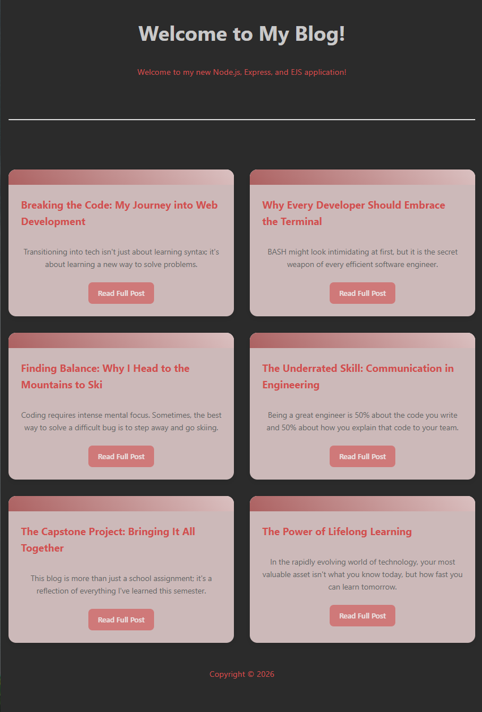
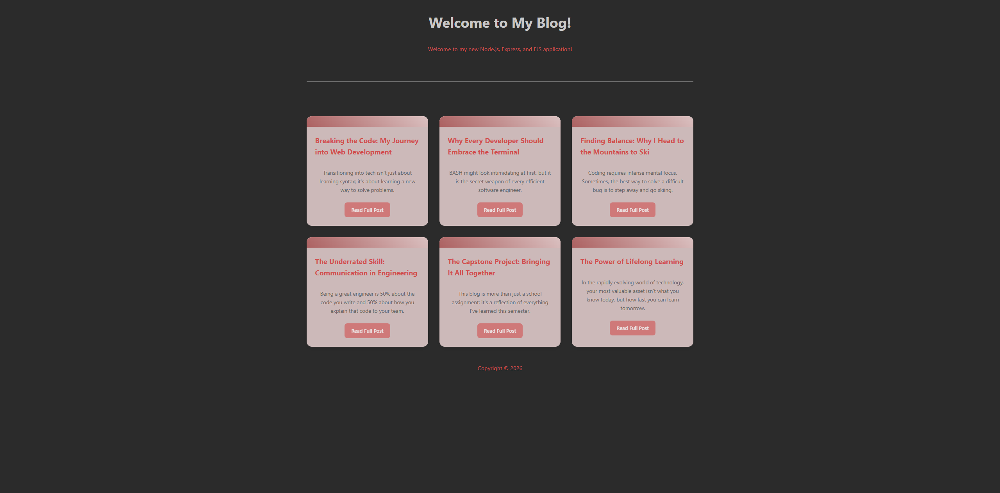
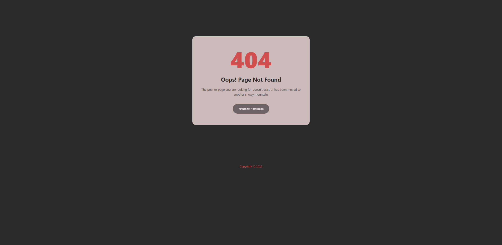
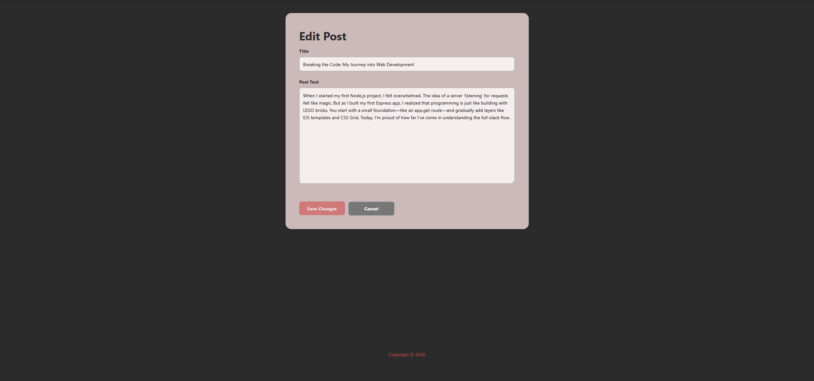

# Dev Blog
A responsive web application demonstrating the implementation of Node.js and Express for server-side logic and EJS for dynamic templating.

---

## Screenshots

### 📱 Responsive Homepage

  
Click to view screenshots (Desktop, Tablet, Mobile)

- Tablet Version
  
- Mobile Version
  

## Error Page & Desktop Version

- Desktop Version
  
- 404 Error Page
  

## Editing Posts

Posts can be edited in place using the pencil icon on the post page. Saved edits are timestamped and shown next to the publish date.

- Post Page (with edit icon)
  
- Edit Page
  .png)

---

## Features

- Dynamic Routing: Individual pages for blog posts.
- Post Editing: Edit and save existing posts, with an "Edited" timestamp shown once a post is updated.
- Custom Design: Responsive CSS Grid layout.
- Error Handling: Custom 404 page for missing routes.
- Content: Insights on Node.js, BASH, and Skiing.

Tech Stack
Backend: Node.js & Express
Frontend: EJS & CSS

---

## Setup

Install dependencies:
npm install

## Run the server:

node app.js

Visit: http://localhost:3030

---

Project Structure

app.js - Server logic
views/ - EJS templates
public/ - CSS styles

Created by Tetyana
